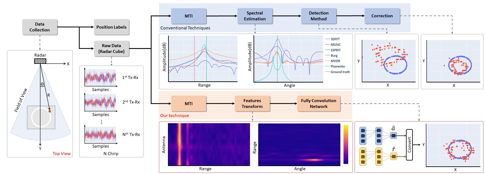
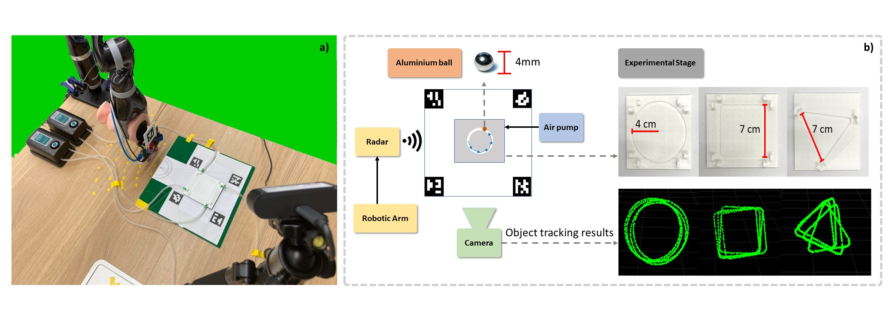

# RA-CNN (Towards Ant-sized Moving Object Localization using Deep Learning in FMCW Radar: A Pilot Study)
## Abstract
We propose a deep learning-based approach to localizing a small moving object with a single millimeter-wave frequency-modulated continuous-wave radar (FMCW). The main challenge that foils conventional localization techniques, such as 3DFFT, Pisarenko method, MUSIC, ESPRIT, Capon’s method, and Burg’s method is the low signal-to-noise ratio of the reflected signal from millimeter-sized objects. Our key idea is to combine useful but noisy features from classical transforms (e.g. FFT) with neural networks that can refine and interpret those features into range and angle estimates by training on a large dataset of examples. Importantly, our networks were designed to be translation-equivariant, which enables accurate predictions of unseen object locations, and improves the range and azimuth RMSE scores by 34-46% and 41-60%, respectively, over state-of-the-art approaches. This pilot study establishes a new baseline for small-object tracking using FMCW and can enable tracking of small animals, such as ants inside the colony for behavior studies.
## Dataset Request Link
[Link](https://docs.google.com/forms/d/e/1FAIpQLSeQoYSWgVwbQXtHblEKB43jZwJdEc_ObEkVUGAmlc0J1OEQow/viewform?usp=pp_url)
## Dataset Description
There are totally 360 files. There are 3 files type include 
1. "raw_signal_real_x.npy" (real part of radar IQ data)
2. "raw_signal_imag_x.npy" (imaginary part of radar IQ data)
3. "label_x.npy" (position label)
### Dataset shape
1. raw_signal_real_x > (samples, chirps, ADC samples, TX/RX) > shape (340, 16, 512, 8) in each files.
2. raw_signal_imag_x > (samples, chirps, ADC samples, TX/RX) > shape (340, 16, 512, 8) in each files.
3. label_x > (samples, position) > shape (340, 3)
   
**Note**: RA-CNN only predicts  and .

## Our setup
 

**Fig. 1.** Overview of our study and setup.

 

**Fig. 2.** Our experiment setup consists of a 3D-printed ball track connected to air pumps to drive the ball, an FMCW radar held by a robotic arm, and a
webcam to collect the ground-truth ball locations. We designed 3 different track shapes, and on the bottom right, we show superimposed visualizations of the
estimated ball locations from different captures with different radar locations.

## Citation
Please cite [our paper](https://ieeexplore.ieee.org/abstract/document/9761934), if you use any part of our model and dataset.
## References

    @ARTICLE{9761934, 
    author={Kumchaiseemak, Nakorn and Chatnuntawech, Itthi and Teerapittayanon, Surat and Kotchapansompote, Palakon and Kaewlee, Thitikorn and Piriyajitakonkij, Maytus and Wilaiprasitporn, Theerawit and Suwajanakorn, Supasorn},  
    journal={IEEE Transactions on Geoscience and Remote Sensing}, 
    title={Towards Ant-sized Moving Object Localization Using Deep Learning in FMCW Radar: A Pilot Study},   
    year={2022},  
    volume={},  
    number={},  
    pages={1-1},  
    doi={10.1109/TGRS.2022.3169642}
    }
